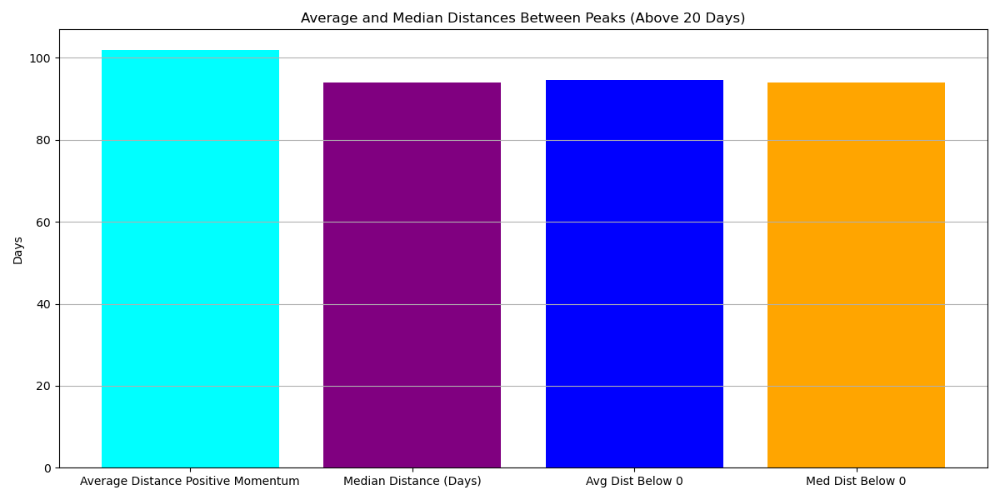
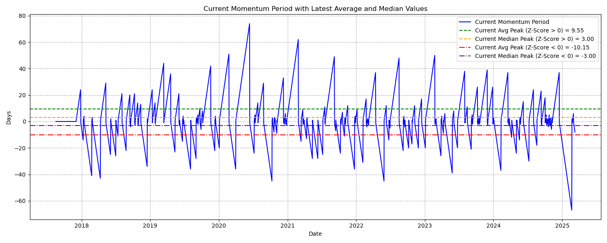
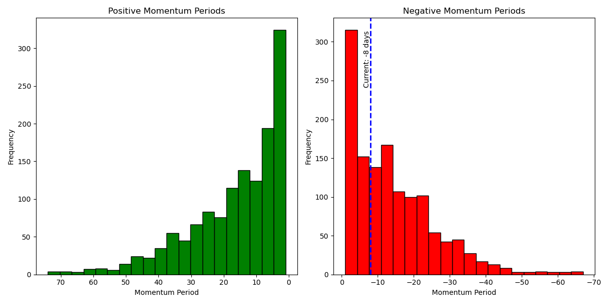
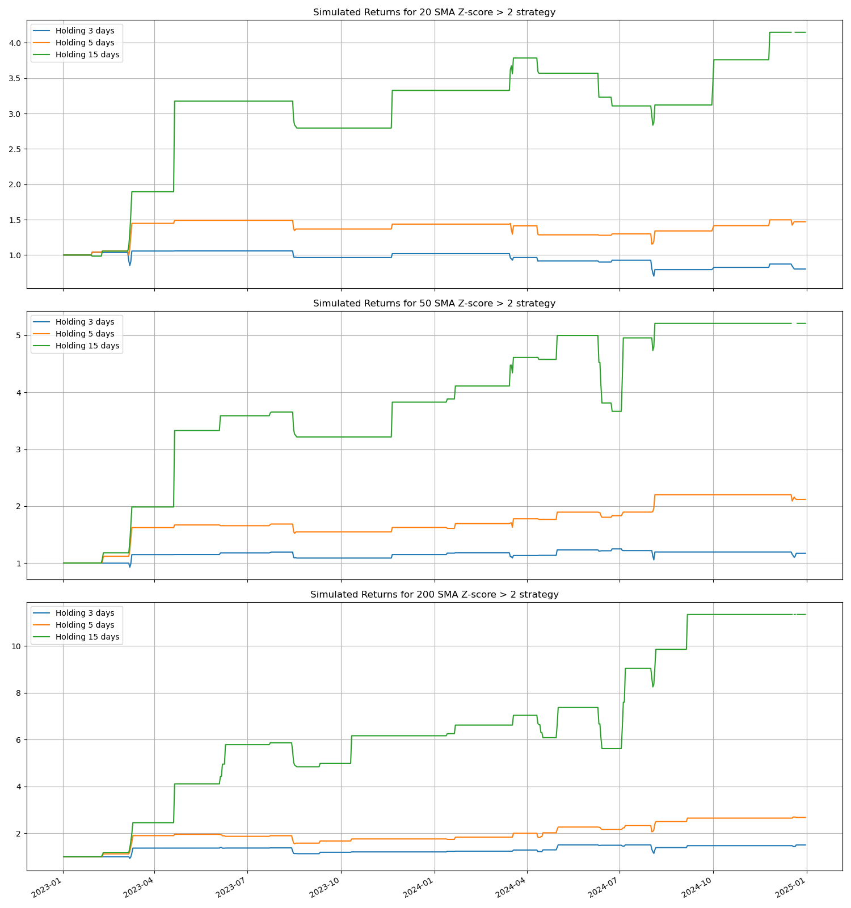
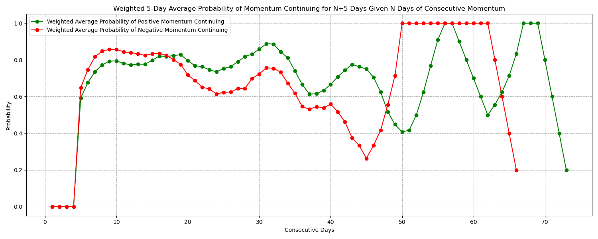

# Market-Momentum-Report
Calculates a momentum report based on historical vs current momentum behavior.  
Based on research provided by [Pedma](https://pedma7.substack.com/). Modified to include Bybit data and push results/plots to a Discord server.  
  
  
  
  
  
  

# HOW TO:  
1. Install requirements.
2. Change your file path on line 737 in order to save the plots.  
This program downloads all of the exchange data, calculates results, plots results, and then saves the plots locally and converts both the plots/results into a payload for sending off to discord.  

Enjoy!
